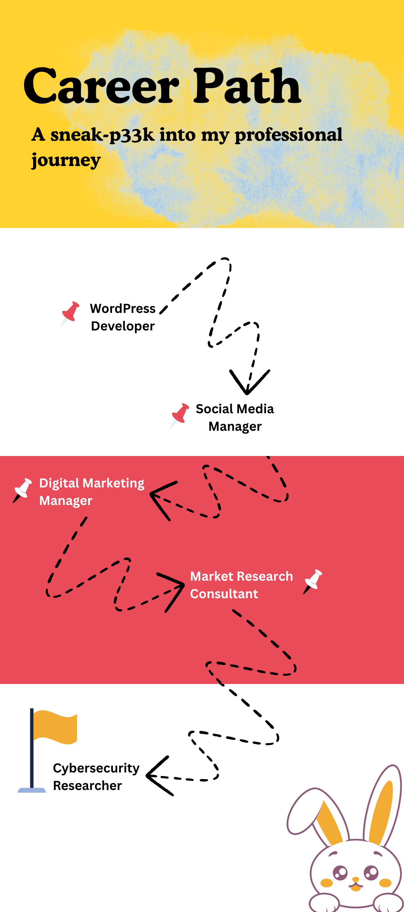

 

---------------

:point_right: I am Bhavesh Verma, a Cybersecurity Researcher & an Open Source Developer. Previously, I was a Marketer & a Market Research Consultant.

:point_right: I have written two books in the field of marketing; [Fundamentals of Digital Marketing](https://www.amazon.in/Fundamentals-Digital-Marketing-Bhavesh-Verma-ebook/dp/B0BTCP7J68), & [Branding: The Key to Modern Business.](https://www.amazon.in/Branding-Modern-Business-Bhavesh-Verma-ebook/dp/B0C6BQSDK2)

  

  

:point_right: I occasionally write about trends & recent updates in the realms of [Cybersecurity](https://alphacyberlabs.substack.com)

:point_right: I am on a journey to make Internet a safe place & a reliable companion for individuals in their day to day lives. With increasing individual digital footprint, it becomes crucial to protect personal data.
The most important aspect of my job is to make sure that every individual is equally protected when surfing the Internet. That is what I love the most about my job. Yeah! I'm the Dark Knight! :grin:

:point_right: I am open to collaborating with FOSS for their pentesting requirements, reach out to me at 

  

--------------------------

 
